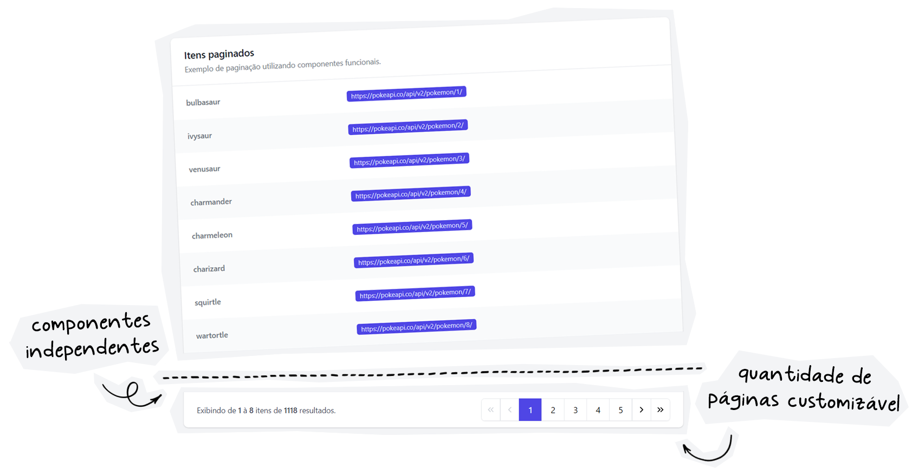

# React Pager



React-Pager é um exemplo de componente paginado de forma dinâmica, utilizando componentes funcionais. É possível encontrar uma demonstração [clicando aqui]().

## Recursos

- Paginação personalizada em quantidade de itens e páginas exibidas
- Design responsivo utilizando Tailwind CSS
- Componentes individuais operando em conjunto

## Motivação

O projeto foi criado com o intuito de implementar, de forma geral, um componente de paginação que fosse totalmente independente de bibliotecas externas. É possível encontrar uma versão da função de paginação mais simples e mais explicativa [neste gist](https://gist.github.com/hypertenso/0e3ebda4f6cb78e5fa1ade8dda3c4daf).

## Como utilizar

Para iniciar o projeto, acesse a pasta pasta principal do projeto via terminal e execute os seguintes comandos:

```
npm install
```
```
npm start
```
O segundo comando irá iniciar o projeto em modo de desenvolvimento. Abra o link [http://localhost:3000](http://localhost:3000) para visualizar o exemplo no navegador.

## Feedback

Sinta-se a vontade para abrir issues, discutir e contribuir com o projeto. Em breve disponibilizarei um servidor do Discord.